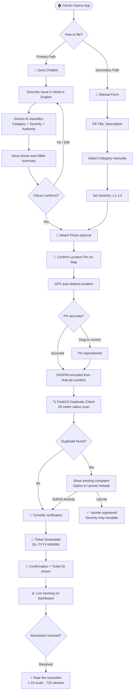
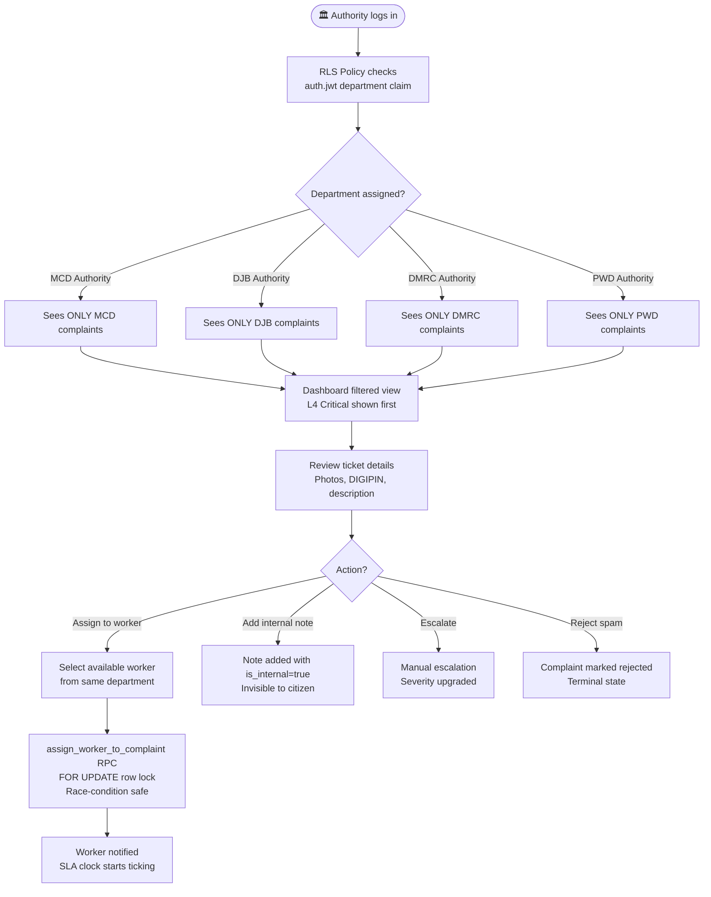
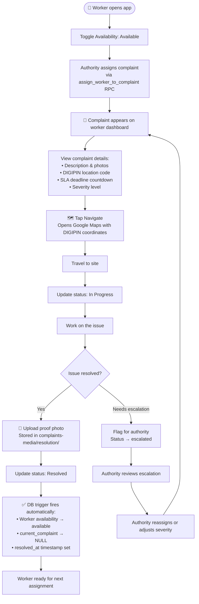
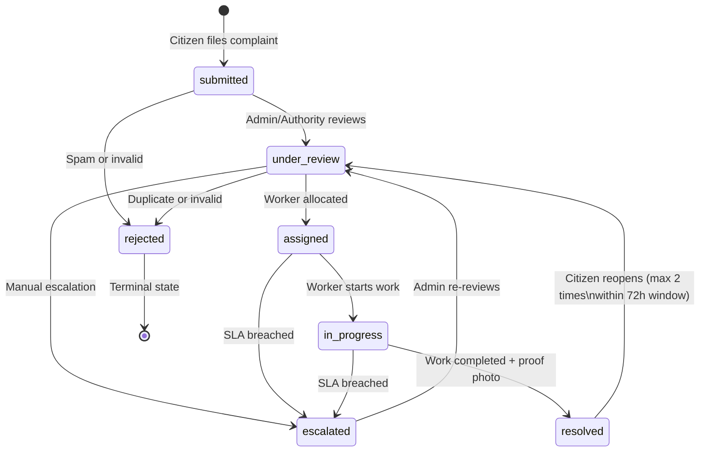
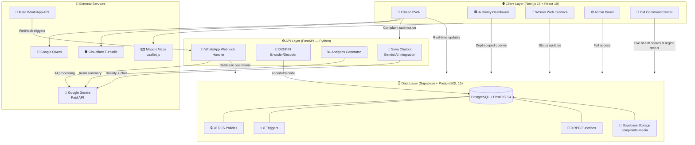

<div align="center">

<!-- Logo: Use the JanSamadhan emblem SVG here -->


# JanSamadhan

### *जन समाधान — Citizen Resolution Platform*

**A Production-Ready Smart Civic Grievance Management System for India**

[](https://jansamadhan.perkkk.dev/)
[](https://nextjs.org/)
[](https://supabase.com/)
[](https://fastapi.tiangolo.com/)
[-4285F4?style=for-the-badge&logo=google&logoColor=white)](https://ai.google.dev/)
[](https://www.indiapost.gov.in/)

> **Hackathon Submission · March 2026 · Team 404**

*Every complaint is a contract between a citizen and their government.*
*JanSamadhan makes that contract **visible, enforceable, and measurable.***

</div>

---

## 🎬 Demo Video

[](https://www.youtube.com/watch?v=4Mb1QKaJfK8)

## 📋 Table of Contents

1. [Problem Statement](#-problem-statement)
2. [Why JanSamadhan is Different](#-why-jansamadhan-is-different)
3. [April 2026 Feature Update](#-april-2026-feature-update)
4. [The 5 Major Portals & Command Center](#-the-5-major-portals--command-center)
5. [Setup Guide](#-setup-guide)
6. [How To Start (Local Runtime)](#-how-to-start-local-runtime)
7. [Citizen Flow — Filing a Complaint](#-citizen-flow--filing-a-complaint)
   - [Seva Chatbot (Gemini AI — Primary Path)](#-seva-chatbot--gemini-ai--primary-path)
   - [Manual Submission (Secondary Path)](#-manual-submission-secondary-path)
   - [Location Pin & DIGIPIN](#-location-pin--digipin)
   - [How a Ticket is Generated](#-how-a-ticket-is-generated)
8. [WhatsApp Bot Integration (Multilingual Civic Assistant)](#-whatsapp-bot-integration-multilingual-civic-assistant)
9. [Complaint Categories (42+ across 9 Delhi Zones)](#-complaint-categories-42-across-9-delhi-zones)
10. [Department Mapping (Category to Authority)](#-department-mapping-category-to-authority)
11. [Authority Flow](#-authority-flow--department-scoped-no-overlap)
12. [Worker Flow](#-worker-flow)
13. [Admin Flow](#️-admin-flow)
14. [SLA & Escalation Engine](#-sla--escalation-engine)
15. [2022 Delhi Ward-Wise Spatial Data (PostGIS)](#-2022-delhi-ward-wise-spatial-data-postgis)
16. [Application Architecture](#️-application-architecture)
17. [API Reference](#-api-reference)
18. [Security Design](#-security-design)
19. [Compatibility](#-compatibility)
20. [Roadmap](#-roadmap)
21. [License](#-license)

---

## 🚨 Problem Statement

India has over **4,000 urban local bodies**, 28 state governments, and hundreds of civic departments — all operating **siloed grievance systems** with no interoperability.

| Pain Point | Reality |
|---|---|
| **No single window** | Citizens must know *which* portal to use for *which* issue |
| **Zero visibility** | Complaints disappear — no updates, no timelines |
| **Duplicate filings** | 50 citizens report the same pothole → 50 noise entries |
| **Language barrier** | Most portals require English, excluding 800M+ Hindi speakers |
| **No spatial intelligence** | Authorities can't see complaint clusters or hotspot zones |
| **Worker context gap** | Workers get vague assignments — no photos, no GPS, no SLA |
| **Jurisdictional overlap** | MCD, NDMC, DJB, PWD — complaints land in the wrong department |

> 📊 A **2023 CAG report** found that **34% of CPGRAMS complaints are closed without action.**

**The result:** chronic under-resolution, citizen frustration, and government departments that cannot measure their own performance.

---

## 🧠 Cost-Effective Model Infrastructure & Token Optimization

Because of our structured WhatsApp layer and proper JSON input and output, we have substantially achieved the best possible cost-to-complaint ratio. JanSamadhan operates an extremely cost-optimized AI inference flow powered by a high-speed primary Multimodal LLM (with a secondary fallback model for high resilience), which allows the system to achieve a massive cost advantage over legacy grievance portals.

### 1. WhatsApp & Seva Chatbot Cost Breakdown (Per Complaint)
A typical civic complaint is processed in two stages (Conversational Chat and Multimodal Image Classification):

| Step | LLM Input Type | Input Tokens | Output Tokens | API Cost Basis (USD) | Cost in INR (per complaint) |
|---|---|---|---|---|---|
| **Step 1: Text Intake / Chat** | Conversational prompt, system taxonomy context, and history | ~1,500 | ~150 | Input: $0.075 / 1M tokens<br>Output: $0.30 / 1M tokens | **~₹0.012** (1.2 paise) |
| **Step 2: Image Analysis** | Multimodal prompt with image + categories list | ~1,458 (incl. 258 image tokens) | ~100 | Input: $0.075 / 1M tokens<br>Output: $0.30 / 1M tokens | **~₹0.011** (1.1 paise) |
| **Total Cumulative Cost** | Full chat intake & image classification sequence | **~3,000** | **~250** | — | **~₹0.023** (less than 3 paise) |

### 2. How the Multimodal Model Bills Image Analysis
The underlying LLM charges flat token rates for image payloads based on input dimensions rather than expensive per-image compute. A standard complaint photo corresponds to exactly **258 tokens**. At the primary model's rate of `$0.075 / 1M input tokens`, the actual inference cost to visually classify potholes, garbage, or broken lighting is **₹0.0016** (about `0.15 paise`), making real-time spatial analysis viable at national-scale volumes.

### 3. Infrastructure Cost Comparison at Scale
Thanks to serverless optimization, containerized portability, and the model's negligible token cost, JanSamadhan's infrastructure cost drops significantly as the platform scales compared to legacy manual processing:

- **1-Ward Pilot Baseline**: **₹10.62** per grievance (cloud infra only)
- **20-Ward Delhi Pilot**: **₹6.43** per grievance (cloud infra only)
- **250-Ward Scale (Delhi-wide)**: **₹3.52** per grievance (cloud infra only)
- **Legacy Portals (CPGRAMS / Conventional DARPG)**: Costs **₹83 – ₹250** per grievance due to manual routing administrative overhead and legacy software licensing.

---

## ✨ Why JanSamadhan is Different

| Feature | How It Works |
|---|---|
| 🗺️ **DIGIPIN Integration** | India's official 10-char location code (Dept of Posts). Every complaint gets a permanent, government-standard address — works even offline |
| 🤖 **Seva — Gemini AI Chatbot** | Citizens describe issues in Hindi or English via natural language. Gemini classifies category, severity, and auto-fills the form — no form literacy needed |
| 📍 **Movable Location Pin** | GPS auto-detects position; citizen can drag the map pin to correct it precisely. DIGIPIN re-encodes on every pin drop |
| 🗳️ **Community Severity Escalation** | Citizens upvote complaints. 10+ votes → +1 severity level. 50+ votes → force L4 Critical. Crowd intelligence replaces bureaucratic triage |
| 🔍 **PostGIS Duplicate Detection** | 20-metre radius check prevents spam *before* submission. Citizen is shown existing complaints and can upvote instead |
| 🏢 **Department-Scoped Authority Views** | Each authority only sees complaints from **their department**. Zero cross-department leakage — the #1 problem with CPGRAMS in India |
| 🔒 **ENUM State Machine in DB** | `complaint_status`, `severity_level`, `worker_availability` are PostgreSQL ENUMs. Invalid transitions are impossible even if someone bypasses the app |
| 🤖 **Cloudflare Turnstile** | Bot-spam prevention on complaint submission and login to prevent fake complaint flooding |
| 📋 **Immutable Audit Trail** | Every status change is logged to `ticket_history`. Citizens see public trail; authorities see internal notes. Tamper-proof |

---

## 🆕 April 2026 Feature Update

### 1. Smart Notification Deep Links (Email + WhatsApp)
- Notification links now open the **exact ticket detail page** directly:
    - `https://jansamadhan.perkkk.dev/citizen/tickets/details?id=<complaint_uuid>`
- Backend now supports deployed-domain link control through `FRONTEND_BASE_URL`.
- Implemented for complaint emails, WhatsApp closure-confirmation pings, and guided citizen follow-up.
- WhatsApp bot flow supports menu-driven reporting, image-first intake, location capture, status lookup, and account linking.

### 2. Citizen Closure Confirmation Loop (Pending Closure)
- Added full citizen confirmation loop for `pending_closure` tickets.
- Citizens can explicitly mark outcome as **resolved** or **reopened** from the details page.
- Worker completion can trigger outbound WhatsApp confirmation reminders.

### 3. Admin Dashcam Live Command Center
- Added `/admin/dashcam-live` with persistent telemetry cards for approved dashcam feeds.
- Dashboard behavior is focused on **real-time monitoring and verification workflows**.

### 4. CCTV Reliability Engine + Verification
- AI service now applies multi-trigger reliability checks before auto-ticket creation.
- Verification flow supports `repaired` and `not_repaired` outcomes via `/cctv/verify`.
- DIGIPIN remains a first-class location identity for camera-to-ticket continuity and duplicate suppression.

### 5. Supervised Learning Dataset Pipeline
- Added real-time worker event capture for retraining datasets (`present`, `absent`, `repair_complete`).
- Added deduped sample capture, metrics, and export-batch workflow for model retraining inputs.

### 6. Gamification And Wallet Enhancements
- Added wallet, reward redemption, leaderboard, and spam-penalty integration.
- Added admin wallet sync utility endpoint for retroactive wallet provisioning.

### 7. Voice Input Pipeline
- Added server-side Sarvam STT proxy (`/api/stt`) for multilingual speech-to-text complaint workflows.

### 8. Public Accountability + Spatial Ops
- Ticket details support Twitter/X escalation sharing with tiered authority/public handles.
- Citizen heatmap and nearby complaint discovery remain real-time and severity-aware.
- SLA urgency and breach visibility remain central to worker and authority prioritization.

---

## 🖥️ The 5 Major Portals & Command Center

### Portal Access Credentials

| Role | Portal | Email | Password | Access Method |
|---|---|---|---|---|
| 👤 **Citizen** | `/citizen` (Home) | *Login via Google* | — | Click "Sign in with Google" — auto-assigns Citizen role |
| 🏛️ **Authority** | `/authority` | `authority@gmail.com` | `Test1234!` | Email + Password login + Sign in with Google|
| 👷 **Worker** | `/worker` | `prakharwork@gmail.com` | `Test1234!` | Email + Password login + Sign in with Google|
| ⚙️ **Admin** | `/admin` | `hackathondb@gmail.com` | `Test1234!` | Email + Password login + Sign in with Google|
| 👑 **Chief Minister** | `/cm` | *Public / Closed loop* | — | Directly monitor city and regional health score performance |

> **Note:** Citizens can also sign up manually by clicking "Sign Up", filling the form, and selecting the **Citizen** radio button to assign their role. Admin can invite new Authority and Worker accounts directly from the Admin Dashboard.

---

### Portal Descriptions

#### 👤 Citizen Portal
The public-facing Progressive Web App. Citizens can file complaints via the **Seva chatbot** (primary) or a manual form, track their ticket status in real-time, view complaints on an interactive map, upvote community issues, and rate resolved complaints.

#### 🏛️ Authority Dashboard
A department-scoped dashboard. Authorities only see complaints belonging to their assigned department. They can review tickets, add internal notes, escalate complaints, and assign work to available field workers — all filtered to prevent jurisdictional overlap.

#### 👷 Worker Dashboard
A mobile-optimised field interface. Workers see only their assigned complaints. They update status (in progress → resolved), upload proof photos, and navigate to job sites via Google Maps integration.

#### ⚙️ Admin Panel
Full platform control. Admins can view all complaints across all departments, manage the spatial map view, assign workers, invite new Authority/Worker accounts, view SLA breach reports, and generate AI-powered analytics summaries.

#### 👑 Chief Minister's Command Center (`/cm`)
A high-level command center for the Chief Minister and city executives. Features live health score calculations for the city, administrative zones, and individual wards. Executives can track performance indicators, drill down into regional complaint densities, check active workforce statuses, filter issues dynamically, and view active interventions.

---

## 🛠️ Setup Guide

### Prerequisites

- **Node.js** v18+
- **Python** 3.10+
- **Supabase** project (free tier works)
- **Google Gemini API key** (paid plan required — see note below)
- **Mappls Maps API key**
- **Turnstile site key** (Cloudflare)

> ⚠️ **Gemini API Key must use a billed plan.** JanSamadhan does not assume Gemini free-tier availability. Use budget alerts and per-key quota caps to control spend during demos and production usage. See [API Reference](#-api-reference) for deployment guidance.

---

### Step 1 — Clone the Repository

```bash
git clone https://github.com/your-org/jansamadhan
cd jansamadhan
```

### Step 2 — Configure Environment Variables

Copy the example env file and fill in your credentials:

```bash
cp .env.example .env.local
```

| Variable | Purpose |
|---|---|
| `NEXT_PUBLIC_SUPABASE_URL` | Your Supabase project URL |
| `NEXT_PUBLIC_SUPABASE_ANON_KEY` | Public anon key for client-side calls |
| `SUPABASE_SERVICE_ROLE_KEY` | Service role key for server-side admin operations |
| `SUPABASE_SERVICE_KEY` | Optional fallback service key used by some backend modules |
| `GEMINI_API_KEY` | Google Gemini API key (paid plan) |
| `GEMINI_PRIMARY_MODEL` | Optional override for primary Gemini model |
| `GEMINI_FALLBACK_MODEL` | Optional fallback Gemini model on quota/model errors |
| `MAPPLS_API_KEY` | Mappls Maps API for India geocoding |
| `NEXT_PUBLIC_API_URL` | FastAPI backend URL (Railway or local) |
| `NEXT_PUBLIC_TURNSTILE_SITE_KEY` | Cloudflare Turnstile site key |
| `TURNSTILE_SECRET_KEY` | Server-side secret for Turnstile verification API |
| `SARVAM_API_KEY` | Server-side API key for speech-to-text proxy (`/api/stt`) |
| `RESEND_API_KEY` | Resend key for transactional notifications |
| `RESEND_FROM_EMAIL` | Sender identity for complaint emails |
| `FRONTEND_BASE_URL` | Canonical deployed frontend base URL for deep links |
| `AI_SERVICE_URL` | URL of the standalone AI service used by CCTV proxy endpoints |
| `REDIS_URL` | Redis cache/session backend for API optimization |
| `WHATSAPP_TOKEN` | Meta WhatsApp Cloud API token |
| `WHATSAPP_PHONE_NUMBER_ID` | WhatsApp sender phone number ID |
| `WHATSAPP_VERIFY_TOKEN` | Verification token for webhook handshake |

### Step 3 — Database Setup

Run the SQL blocks in your Supabase SQL editor **in order**:

1. Create 3 ENUM types (`complaint_status`, `severity_level`, `worker_availability`)
2. Create all 8 tables in dependency order
3. Create spatial + performance indexes (GIST on geography column)
4. Create ticket ID sequence and `generate_ticket_id` trigger
5. Create all 8 trigger functions and attach them
6. Create all 9 RPC functions
7. Enable RLS and create all 28 policies
8. Seed 43 categories across 9 Delhi authority zones
9. Create `complaints-media` storage bucket from the Supabase Dashboard UI

### Step 4 — Install Dependencies

This project uses `pnpm` workspaces. Install all dependencies from the root directory:

```bash
pnpm install
```

### Step 5 — Start All Services (Recommended)

Run the whole stack using Docker Compose from the repository root:

```bash
docker compose up --build
```

Available endpoints in this mode:
- Web app: `http://localhost:8080`
- FastAPI backend: `http://localhost:8000`
- AI service health: `http://localhost:8001/health`

### Step 6 — Start Manually (3 Terminals)

Use this if you want hot reload and service-level debugging.

Terminal 1 — Frontend:

```bash
cd apps/web
pnpm run dev
```

Terminal 2 — FastAPI backend:

```bash
cd apps/api
python3 -m venv .venv
source .venv/bin/activate
pip install -r requirements.txt
uvicorn main:app --reload --port 8000
```

Terminal 3 — AI service:

```bash
cd ai-service
python3 -m venv .venv
source .venv/bin/activate
pip install -r requirements.txt
uvicorn service.main:app --reload --port 8001
```

Manual runtime endpoints:
- Web app: `http://localhost:3000`
- FastAPI backend: `http://localhost:8000`
- AI service health: `http://localhost:8001/health`

---

## 🚀 How To Start (Local Runtime)

If you want the fastest local bring-up, run:

```bash
docker compose up --build
```

If you want per-service debugging, run frontend/backend/AI service in separate terminals using Step 6 above.

---

## 🧭 Citizen Flow — Filing a Complaint

There are two ways a citizen can submit a complaint. The chatbot is the **primary, recommended path** — it's faster, smarter, and eliminates form-filling entirely.



---

### 💬 Seva Chatbot — Gemini AI (Primary Path)

**Seva** is JanSamadhan's AI-powered complaint assistant, built on **Google Gemini** (paid API). It transforms complaint filing from "fill a 10-field form" to "just tell me what happened."

#### What Seva Does

- Accepts free-text input in **Hindi or English**
- Uses Gemini's agentic reasoning to classify the complaint into one of **43 categories**
- Suggests the correct **severity level (L1–L4)** based on urgency language
- Identifies the **responsible authority** (e.g., "broken metro escalator" → DMRC)
- **Auto-fills the complaint form** — citizen just confirms and submits
- Conducts **multi-turn conversation** — asks clarifying questions if input is ambiguous
- Stores intent and session data in the `seva_queries` table for analytics

#### Example Conversation

```
Citizen:  "Hamare gali mein kachra 3 din se nahi utha — bohot badsbu aa rahi hai"

Seva:     "I've identified your issue:
           📋 Category   : Garbage Collection (MCD)
           🏢 Authority  : Municipal Corporation of Delhi
           ⚠️  Severity   : L3 — High (48-hour SLA)
           📍 Location   : Auto-detected from your GPS

           Shall I file this complaint at your current location?"

Citizen:  "Haan"

Seva:     "✅ Complaint filed. Your ticket number is DL-2026-00312.
           You can track it live on your dashboard."
```

> 🔑 **Gemini billing model:** JanSamadhan assumes a billed Gemini API key with explicit quota caps and budget alerts. This avoids dependency on changing free-tier availability while keeping runtime predictable for demos and production.

---

### 📝 Manual Submission (Secondary Path)

For citizens who prefer the form approach, every field that Seva fills automatically is available manually:

1. Enter complaint title and description
2. Select a category from the 42+ category tree
3. Set severity level (L1 Low → L4 Critical)
4. Attach up to one photo (HEIC/JPEG/PNG, 5MB limit)
5. Confirm location on the map (see below)

---

### 📍 Location Pin & DIGIPIN

Location accuracy is critical for civic complaints. JanSamadhan solves this with a two-step location confirmation:

```
Step 1: GPS auto-detection
        ↓
        Map centres on your current coordinates

Step 2: Visual confirmation + drag-to-correct
        ↓
        You can drag the pin to the EXACT location
        (e.g., the specific pothole, not your home)

Step 3: DIGIPIN encoding
        ↓
        Final pin position → FastAPI /digipin/:lat/:lng
        → 10-character government-standard code
        → Stored permanently in complaints.digipin
```

#### What is DIGIPIN?

**DIGIPIN (Digital Postal Index Number)** is India's official location coding system developed by the **Department of Posts, Government of India**. It encodes any GPS coordinate into a **10-character alphanumeric code** that identifies a **4m × 4m area** anywhere in India.

```
Example:  28.6315°N, 77.2167°E  →  39J-948-H2PK
```

| Why DIGIPIN matters in JanSamadhan |
|---|
| Works in areas **without street names** — slums, villages, new colonies |
| **Works offline** — DIGIPIN is calculated from GPS, no internet needed |
| Field workers can navigate to a **4m × 4m square** — no address ambiguity |
| Survives **address renaming and subdivision** — permanent identifier |
| Enables **zone/ward-level aggregates** by DIGIPIN prefix for analytics |

---

### 🎫 How a Ticket is Generated

Once the location is confirmed and reCAPTCHA passes, the system runs a sequence of automatic operations:

```
1. PostGIS duplicate check (ST_DWithin 20m radius)
       ↓ No duplicate found
2. Complaint row inserted into database
       ↓ BEFORE INSERT trigger fires
3. Ticket ID generated: DL-{YEAR}-{SEQUENCE}
   e.g. DL-2026-00312
       ↓
4. SLA deadline set based on severity:
   L4 → 4 hours   | L3 → 48 hours
   L2 → 7 days    | L1 → 14 days
       ↓
5. Initial ticket_history row created (submitted)
       ↓
6. Citizen receives confirmation with ticket ID
```

The ticket ID sequence is guaranteed unique via a PostgreSQL `SEQUENCE` — no race conditions possible.

---

## 💬 WhatsApp Bot Integration (Multilingual Civic Assistant)

JanSamadhan includes a fully-featured, production-ready WhatsApp Chatbot that acts as a conversational ingress channel for citizens. Integrated directly with the Meta Cloud API and backed by our FastAPI service and Redis session management, it simplifies civic reporting.

### 🌟 Key Capabilities
- **Multilingual Support**: Supports 10 regional Indian languages (English, Hindi, Tamil, Telugu, Kannada, Malayalam, Bengali, Marathi, Gujarati, Punjabi). Language selection is handled dynamically via WhatsApp Interactive List Messages.
- **Conversational Intake (Powered by Gemini)**: Citizens can describe the problem in natural language (Hindi or English text). Gemini's agentic flow automatically identifies the category, appropriate severity level, and responsible authority.
- **Image-First Flow & Content Safety**: Citizens upload a photo of the issue first. The chatbot runs content moderation checks and classification on the photo, then matches the photo with the subsequent description.
- **Native Location Sharing**: The bot prompts citizens using WhatsApp's native location-sharing UI. The latitude/longitude coordinate pair is geocoded to an address, validated to ensure it lies within India, and checked for active duplicates.
- **PostGIS Proximity Duplicate Suppression**: Prior to ticket creation, the bot scans a 20-meter radius for existing complaints. If a match is found, the user is given options to **Upvote** the existing ticket (escalating its urgency) or **Submit Anyway**.
- **Bidirectional Account Linking**: Users can link their WhatsApp number to their JanSamadhan web profile using a portal-generated link code (`link-<CODE>`). Once linked, all WhatsApp submissions sync automatically with their online dashboard.
- **Status Inquiry**: Citizens can check the progress of their complaints directly inside WhatsApp at any time (e.g., sending `status DL-2026-00042` or using the "Recent Tickets" list menu).
- **Outbound Closure Alerts**: Field worker completion events automatically trigger outbound WhatsApp notifications to citizens, seeking closure verification.

---

## 🗂️ Complaint Categories (42+ across 9 Delhi Zones)

JanSamadhan covers **42+ complaint types** spanning **9 Delhi jurisdiction bodies**: DMRC, NHAI, PWD, MCD, NDMC, DJB, DISCOM, Delhi Police, Forest Dept, and DPCC.

| 🏗️ Category | Child Issues Covered |
|---|---|
| 🚇 **Metro** | Metro Station Issue, Track / Safety Hazard, Escalator / Lift Malfunction, Metro Parking, Station Hygiene, Metro Property Damage |
| 🛣️ **Roads & Infrastructure** | National Highway Damage, Toll Plaza Issue, Expressway Problem, Highway Bridge Damage, State Highway / City Road, Flyover / Overbridge, Large Drainage System, Colony Road / Lane |
| 💧 **Water & Sewage** | Water Supply Failure, Water Pipe Leakage, Sewer Line Blockage, Contaminated Water |
| ⚡ **Electricity** | Power Outage, Transformer Issue, Exposed / Fallen Wire, Electricity Pole Damage |
| 🗑️ **Sanitation & Waste** | Garbage Collection, Street Sweeping, Public Toilet, Local Drain / Sewage, Stray Animals |
| 🌳 **Parks & Public Spaces** | Park Maintenance |
| 🚔 **Law & Safety** | Crime / Safety Issue, Traffic Signal Problem, Illegal Parking, Road Accident Black Spot |
| 🌿 **Environment** | Illegal Tree Cutting, Air Pollution / Burning, Noise Pollution, Industrial Waste Dumping |
| 💡 **Lighting** | Street Light (MCD Zone), NDMC Street Light |
| 🏛️ **Government Property** | Government Building Issue |
| 🏙️ **NDMC Zone** | Central Govt Residential Zone, Connaught Place / Lutyens Issue, NDMC Road / Infrastructure |

---

## 🧭 Department Mapping (Category to Authority)

Department mapping is enforced through seeded category metadata and authority-scoped workflows.

| Category Family | Authority Owner |
|---|---|
| Metro | DMRC |
| National highways and toll corridors | NHAI |
| City roads and public works | PWD / MCD / NDMC (by route zone) |
| Water and sewage | DJB |
| Electricity infra | DISCOM |
| Sanitation and waste | MCD / NDMC (by route zone) |
| Law and traffic safety | Delhi Police |
| Environment and tree protection | DPCC / Forest Department |

Routing behavior:
1. Complaint category selection determines authority ownership from the categories seed data.
2. Authority dashboards only fetch tickets for their mapped department domain.
3. Worker assignment is performed in the same authority domain to prevent cross-department leakage.

---

## 🏛️ Authority Flow — Department-Scoped, No Overlap

> **This solves one of India's biggest governance problems.**

In existing systems like CPGRAMS, MCD portal, and DJB portal — complaints from all departments are visible to everyone. An MCD officer can see DJB complaints. A PWD officer sees DMRC tickets. This causes confusion, misrouting, and no accountability.

**JanSamadhan enforces strict department isolation at the database level.**



#### Why Department Isolation Matters

```
❌  WITHOUT JanSamadhan:
    Sewer overflow reported → lands in PWD dashboard →
    PWD says "not our problem" → DJB never sees it →
    Complaint dies

✅  WITH JanSamadhan:
    Sewer overflow reported → Seva/category maps to DJB →
    RLS ensures ONLY DJB authority can see and act on it →
    Clear ownership, clear accountability
```

**Row-Level Security (RLS)** enforces this at the PostgreSQL layer — not the frontend. Even if someone bypasses the app UI, the database will block cross-department access.

---

## 👷 Worker Flow

Workers operate from a **mobile-first web interface** designed for one-hand use in the field.



#### What Workers Can and Cannot See

| ✅ Worker CAN | ❌ Worker CANNOT |
|---|---|
| See their assigned complaints | See other workers' complaints |
| Update status for their complaints | Change complaint category or authority |
| Upload resolution proof photos | View internal authority notes |
| Navigate to complaint location | Assign themselves to other complaints |
| View their total resolved count | Access admin or authority dashboards |

---

## ⚙️ Admin Flow

Admin has **full access** across all departments and cities.

```
Admin Capabilities:
├── View ALL complaints (all departments, all statuses)
├── Spatial map view — see complaint clusters and hotspots
├── Assign workers to any complaint (atomic RPC with race-safety)
├── Invite new Authority and Worker accounts via email
│     └── Invitation carries metadata: role, department, city
│     └── on_auth_user_created trigger auto-creates profiles
├── View SLA breach dashboard — complaints past deadline
├── Trigger manual escalation
├── Access AI analytics summary (Gemini-generated weekly report)
└── Full audit trail — all 28 RLS policies still logged
```

---

## ⏱️ SLA & Escalation Engine

### SLA Deadlines by Severity

| Level | Deadline | Impact | Example Issues |
|---|---|---|---|
| 🟢 **L1 — Low** | 14 days | Minor inconvenience | Overgrown park, peeling paint |
| 🟡 **L2 — Medium** | 7 days | Moderate public impact | Pothole, broken streetlight |
| 🟠 **L3 — High** | 48 hours | Public disruption | Garbage pile, road blockage |
| 🔴 **L4 — Critical** | 4 hours | Emergency hazard | Sewage overflow, live wire |

### Community Severity Escalation

Citizens collectively upgrade complaint priority through upvotes:

| Upvotes Received | Severity Boost | Example (starts L2) | Example (starts L3) |
|---|---|---|---|
| 0 – 9 | No change | L2 stays L2 | L3 stays L3 |
| 10 – 24 | +1 level | L2 → L3 | L3 → L4 |
| 25 – 49 | +2 levels | L2 → L4 | L3 → L4 |
| 50+ | Force L4 Critical | L2 → L4 | L3 → L4 |

> Severity can **never go down** — `effective_severity` is always ≥ `severity`.  
> At **15+ upvotes**, the `possible_duplicate` flag is raised for admin review.

### Auto-Escalation on SLA Breach

A cron-callable RPC `check_sla_breaches()` runs periodically and automatically escalates complaints that have passed their SLA deadline:

```
complaint_status: assigned → escalated   (if SLA breached)
complaint_status: in_progress → escalated (if SLA breached)
```

Escalated complaints are surfaced at the top of the authority dashboard with a ⚠️ visual indicator.

### Complaint Lifecycle State Machine



> The `enforce_status_transition()` trigger runs **BEFORE** every status `UPDATE` and raises a PostgreSQL exception for any invalid transition. This cannot be bypassed from the frontend.

---

## 🗺️ 2022 Delhi Ward-Wise Spatial Data (PostGIS)

For high-granularity spatial analysis, JanSamadhan leverages the official **2022 Delhi Ward Delimitation Boundary Dataset** containing **250 unified municipal wards** mapped to the **12 administrative MCD zones**:

```
250 Wards (Unified Delhi 2022) ──> Grouped into ──> 12 MCD Administrative Zones
                                                      (e.g., Rohini, Civil Lines, South, etc.)
```

### ⚙️ Database & PostGIS Integration
- **PostGIS Geometries**: Wards are stored in the `spatial_wards` table as GIS polygon/multipolygon geometries (`geom`) using standard coordinate references.
- **Database Views**: The `ward_geojson` view formats these geometries into standard GeoJSON structures for consumption by frontend applications.
- **Ward-Level Metadata**: Each ward row includes:
  - Assembly Constituency (AC) code and name (e.g., `ac_name`)
  - Total Ward Population statistics (e.g., `totalpop`)
  - SC Population statistics (e.g., `sc_pop`)
  - Zone mapping relationships (mapping ward numbers to one of the 12 MCD zones)

### 📈 Real-Time Regional Health Scores (CM Dashboard)
Using coordinates from the `complaints` table, Turf.js calculations in the CM Command Center perform real-time point-in-polygon checks (`@turf/boolean-point-in-polygon`) against these 250 ward boundaries. This enables live health scores:
$$\text{Health Score} = \left( \frac{\text{Resolved Complaints}}{\text{Total Complaints}} \times 0.4 + \frac{\text{SLA-Compliant Complaints}}{\text{Total Complaints}} \times 0.6 \right) \times 100$$
This score is computed dynamically and aggregated at:
1. **Delhi-Wide (State) Level**
2. **Zone Level (12 Administrative Zones)**
3. **Ward Level (250 Municipal Wards)**

---

## 🏗️ Application Architecture



### Tech Stack Summary

| Layer | Technology | Purpose |
|---|---|---|
| **Frontend** | Next.js 15 + React 19 + Tailwind v4 | PWA, server components, routing |
| **Backend** | FastAPI (Python) | Seva chatbot, DIGIPIN API, analytics |
| **Database** | PostgreSQL 15 + PostGIS 3.4 (Supabase) | All data, spatial queries, RLS |
| **AI** | Google Gemini (Paid API) | Natural language classification, multi-turn chat |
| **Maps** | Mappls API + Leaflet.js | India-specific geocoding, interactive map |
| **Auth** | Supabase Auth + Google OAuth | Role-based access, magic links |
| **Location Standard** | DIGIPIN (Dept of Posts, GoI) | 10-char 4m×4m location encoding |
| **Bot Protection** | Cloudflare Turnstile | Prevent fake complaint flooding |
| **Storage** | Supabase Storage | Complaint photos and resolution proof |
| **Hosting** | Vercel (frontend) + Railway (FastAPI) | Edge deployment |

---

## 📡 API Reference

### FastAPI Endpoints (apps/api/main.py)

| Endpoint | Method | Purpose |
|---|---|---|
| `/analyze` | `POST` | AI-assisted complaint preview generation |
| `/confirm` | `POST` | Complaint creation with category routing + background notifications |
| `/citizen/tickets` | `GET` | Citizen tickets feed (with caching support) |
| `/citizen/nearby` | `GET` | Nearby map feed for citizen discovery/upvotes |
| `/api/authority/assign` | `PATCH` | Worker assignment and reassignment workflow |
| `/api/worker/supervised-samples` | `POST` | Collect supervised-learning events from workers |
| `/api/supervised-samples/export` | `GET` | Export supervised sample datasets |
| `/api/supervised-samples/metrics` | `GET` | Supervised-learning collection counters and export readiness |
| `/api/notifications/complaint-email` | `POST` | Event-driven complaint email notifications |
| `/api/notify/closure-confirmation` | `POST` | WhatsApp closure confirmation notification trigger |
| `/whatsapp/webhook` | `GET/POST` | WhatsApp webhook verification and bot message intake |
| `/cctv/analyze_live` | `POST` | CCTV AI analysis via backend proxy |
| `/cctv/verify` | `POST` | CCTV verification outcome update (`repaired`/`not_repaired`) |

### Next.js App APIs (apps/web/app/api)

| Endpoint | Method | Purpose |
|---|---|---|
| `/api/complaints` | `POST/PATCH/PUT` | Complaint create/upvote/status actions from web app |
| `/api/chat` | `POST` | Server-side Gemini proxy with model fallback + CORS control |
| `/api/stt` | `POST` | Speech-to-text proxy for voice complaint flow |
| `/api/verify-turnstile` | `POST` | Server-side Turnstile validation |
| `/api/citizen/wallet` | `GET/POST` | Wallet, rewards, and redemption operations |
| `/api/citizen/leaderboard` | `GET` | Citizen leaderboard feed |
| `/api/admin/authorities` | `GET/PATCH/POST` | Admin authority CRUD operations |
| `/api/admin/workers` | `GET/PATCH/POST` | Admin worker CRUD operations |
| `/api/admin/complaints` | `GET` | Admin complaint query API |
| `/api/admin/complaints/spam` | `POST` | Spam moderation + penalty workflow |

### AI Service APIs (ai-service/service/main.py)

| Endpoint | Method | Purpose |
|---|---|---|
| `/health` | `GET` | AI service health and model readiness |
| `/infer/image` | `POST` | Image inference endpoint for model testing |
| `/cctv/analyze_live` | `POST` | Reliability-engine CCTV burst analysis |
| `/cctv/verify` | `POST` | Camera/ticket verification state updates |

### Supabase RPC Functions

| RPC | Purpose |
|---|---|
| `check_for_duplicate_report(lat, lng, category_id)` | PostGIS `ST_DWithin` 20m radius duplicate detection |
| `find_duplicate_complaints_v2(...)` | Extended duplicate search with active-status and radius controls |
| `get_nearby_complaints(lat, lng, radius_m)` | Distance-ranked complaints within configurable radius |
| `increment_upvote_count(complaint_id)` | Atomic upvote + severity recalculation in single transaction |
| `decrement_upvote_count(complaint_id)` | Atomic downvote counter update |
| `assign_worker_to_complaint(complaint_id, worker_id)` | Race-safe worker assignment with `FOR UPDATE` row locks |
| `check_sla_breaches()` | Cron-callable: auto-escalates complaints past their SLA deadline |
| `award_points(user_id, points)` | Wallet points update used by gamification workflows |
| `redeem_reward(user_id, reward_id)` | Reward redemption transaction flow |
| `update_complaint_status_citizen(...)` | Citizen closure decision status update helper |
| `nearest_urgent_complaint(...)` | Worker dispatch helper using proximity + urgency |

### Paid API Configuration & Model Resilience

> **Important:** The `GEMINI_API_KEY` in this project is configured to use Google's **paid, billed API tier** to ensure high-performance reliability.
>
> **Why?** Free-tier availability and rate limits can change. A billed plan with explicit safeguards keeps behavior predictable for real deployments and demos. JanSamadhan therefore uses:
> - No accidental billing charges
> - Graceful degradation when quota is hit (falls back to manual form)
> - Safe for public demo deployment
>
> For production deployment at scale, upgrading to a billed API key with usage caps is recommended.

---

## 🔐 Security Design

### Cloudflare Turnstile
Cloudflare Turnstile is integrated on complaint submission to prevent automated bots from flooding the system with fake complaints. This is critical for a civic platform where complaint volume directly affects authority workload.

### Row-Level Security (28 Policies)
All 8 database tables have RLS enabled. Policies use `auth.uid()` and `auth.jwt()` — never recursive subqueries.

| Role | What They Can Access |
|---|---|
| **Citizen** | Own complaints (insert + read), public complaint listing, upvotes, ratings |
| **Worker** | Only their assigned complaints — cannot see others' |
| **Authority** | Only complaints from their assigned department |
| **Admin** | Full access across all tables |
| **service_role** | Bypass for server-side triggers and cron only |

### DIGIPIN Offline Capability
DIGIPIN encoding is a pure algorithm — no external API call required. Even in low-connectivity areas, complaint location can be accurately encoded and stored.

### ENUM State Machine
`complaint_status`, `severity_level`, and `worker_availability` are PostgreSQL ENUM types. Invalid values are rejected at the database level before any trigger or policy runs.

---

## 📱 Compatibility

| Feature | Support |
|---|---|
| **Mobile browsers** | Chrome, Safari, Firefox (Android and iOS) |
| **Desktop browsers** | Chrome, Firefox, Edge, Safari |
| **Offline capability** | DIGIPIN encoding works offline; complaint form data cached locally |
| **Photo upload** | HEIC (iPhone), JPEG, PNG — auto-converted, 5MB limit |
| **Map** | Leaflet.js with Mappls India tiles — works on 2G+ connections |
| **Language** | Multilingual complaint intake (text + voice): Hindi, English, Tamil, Telugu, Kannada, Malayalam, Bengali, Marathi, Gujarati, Punjabi |

---

## 🗺️ Roadmap — National Deployment

JanSamadhan is designed from day one for national scale. The Delhi pilot covers 9 jurisdiction zones and 42+ categories.

| Phase | Feature | Status |
|---|---|---|
| **Phase 1** | Delhi pilot — 9 zones, 42+ categories | ✅ Complete |
| **Phase 2** | Multi-city: Mumbai (BMC), Bengaluru (BBMP), Chennai (GCC) | 🔄 Planned |
| **Phase 3** | Offline PWA — service worker caching for low-connectivity | 🔄 Planned |
| **Phase 4** | WhatsApp integration — webhook + closure confirmation + guided submission flows | ✅ Live (v1) |
| **Phase 5** | CPGRAMS bridge — API integration for cross-jurisdiction escalation | 🔄 Planned |
| **Phase 6** | Official DIGIPIN REST API (India Post v2, expected 2027) | 🔄 Planned | 

---

## 📄 License

This project is licensed under the **Apache License 2.0**.

Under this license, you own the rights to the software, and anyone who uses, modifies, or distributes this code **must provide attribution** to you by retaining the copyright notice and the `LICENSE` and `NOTICE` files.

For full license details, see the [LICENSE](./LICENSE) and [NOTICE](./NOTICE) files.

---

<div align="center">

---


**जन समाधान**

*Built with ❤️ for 1.4 billion citizens*

[🌐 Live Demo](https://jansamadhan.perkkk.dev/) · [📝 File an Issue](https://jansamadhan.perkkk.dev/) · Hackathon 2026 · Team 404

</div>
