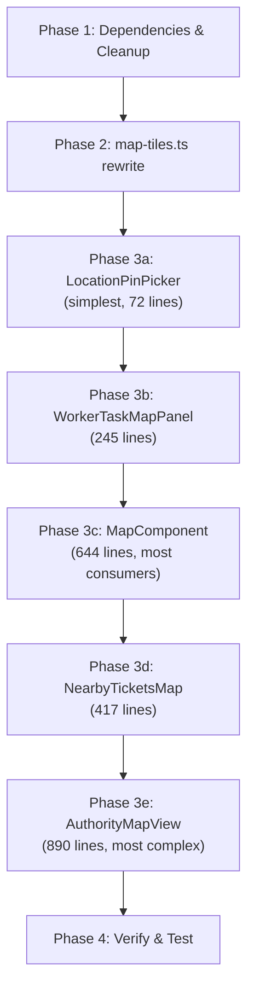

# Leaflet → MapLibre GL JS Migration

Migrate all 5 map components from Leaflet (raster, CPU-rendered) to MapLibre GL JS (vector, GPU-accelerated via WebGL) to achieve 60fps panning/zooming, smooth fractional zoom, instant style switching, and visual parity with NammaKasa.

## User Review Required

> [!IMPORTANT]
> **Tile Provider Choice** — We need a vector tile source. The recommended options are:
> 1. **MapTiler Free Tier** (easiest, 100K free loads/month, requires API key) — best for quick setup
> 2. **Protomaps PMTiles** (self-hosted single `.pmtiles` file on your existing infra) — best for zero-cost long-term, but requires generating/downloading a Delhi region extract
> 3. **OpenFreeMap** (fully free, no key needed, community-hosted) — good middle ground
>
> **Recommendation:** Start with **MapTiler Free** for fastest iteration, then migrate to **PMTiles** self-hosted on Supabase Storage later if costs become a concern.

> [!WARNING]
> **Breaking Change — Leaflet CSS removal.** The global `@import "leaflet/dist/leaflet.css"` in [globals.css](file:///Users/shrey/Projects/ps-crmdev1/apps/web/app/globals.css) will be replaced with `maplibre-gl/dist/maplibre-gl.css`. Any page that uses Leaflet components outside of the 5 identified map files will break. The full audit shows no other Leaflet consumers exist beyond the files listed below.

## Open Questions

> [!IMPORTANT]
> 1. **Which tile provider do you want to start with?** MapTiler (needs API key), OpenFreeMap (no key), or Protomaps PMTiles (self-hosted)?
> 2. **Do you want to keep `highQuality` as a prop?** With MapLibre, vector tiles are always crisp at every zoom level, so this distinction is less meaningful. We could repurpose it to control other quality features (e.g., 3D buildings, terrain).
> 3. **Do you want to preserve the exact same CARTO-style map appearance**, or are you open to a more modern style (e.g., MapTiler Streets, OpenFreeMap's Positron)?

---

## Scope — Files to Modify/Replace

The migration touches **13 files** across the codebase. All 5 map components, 2 utility files, 1 CSS file, 2 type declaration files, and 3 config/dependency files.

### Map Components (5 files — full rewrite)

| # | File | Lines | Used By | Key Features to Preserve |
|---|------|-------|---------|--------------------------|
| 1 | [MapComponent.tsx](file:///Users/shrey/Projects/ps-crmdev1/apps/web/components/MapComponent.tsx) | 644 | CM Dashboard (MapSection), Admin Heatmap, Citizen Heatmap, Citizen Reports, Authority Track, Public Map, DashboardHotspotsMap | GeoJSON choropleth regions, heatmap layer, severity markers, region click/hover/tooltips, fit-bounds, recenter button, realtime subscription, layer category filters |
| 2 | [AuthorityMapView.tsx](file:///Users/shrey/Projects/ps-crmdev1/apps/web/app/authority/map/_components/AuthorityMapView.tsx) | 890 | Authority Map Page | Marker clusters, heatmap, severity filter, status filter, ticket detail sidebar, assign worker dropdown, severity legend |
| 3 | [NearbyTicketsMap.tsx](file:///Users/shrey/Projects/ps-crmdev1/apps/web/app/citizen/nearby/_components/NearbyTicketsMap.tsx) | 417 | Citizen Nearby Page, ManualReportForm | Photo thumbnail markers, radius circle overlay, user location dot, draggable report pin, heatmap toggle, radius slider, live GPS follow, collapse/expand, fly-to |
| 4 | [LocationPinPicker.tsx](file:///Users/shrey/Projects/ps-crmdev1/apps/web/components/LocationPinPicker.tsx) | 72 | ChatPanel | Draggable marker, fly-to on prop change |
| 5 | [WorkerTaskMapPanel.tsx](file:///Users/shrey/Projects/ps-crmdev1/apps/web/components/worker-dashboard/WorkerTaskMapPanel.tsx) | 245 | Worker Dashboard Page | Task markers with popups, fit-bounds, zoom-to-highlighted, resize observer, reset view button |

### Utility / Config Files (8 files — modify or delete)

| # | File | Action | Rationale |
|---|------|--------|-----------|
| 6 | [map-tiles.ts](file:///Users/shrey/Projects/ps-crmdev1/apps/web/lib/map-tiles.ts) | **REWRITE** | Replace raster CARTO tile URLs with MapLibre vector style URLs (light/dark) |
| 7 | [parse-location.ts](file:///Users/shrey/Projects/ps-crmdev1/apps/web/lib/parse-location.ts) | **KEEP** (no changes) | Pure SSR-safe utility, no Leaflet dependency |
| 8 | [globals.css](file:///Users/shrey/Projects/ps-crmdev1/apps/web/app/globals.css) | **MODIFY** | Replace `@import "leaflet/dist/leaflet.css"` → `@import "maplibre-gl/dist/maplibre-gl.css"` |
| 9 | [leaflet-heat.d.ts](file:///Users/shrey/Projects/ps-crmdev1/apps/web/leaflet-heat.d.ts) | **DELETE** | No longer needed — heatmaps are native MapLibre layers |
| 10 | [react-leaflet-markercluster.d.ts](file:///Users/shrey/Projects/ps-crmdev1/apps/web/src/types/react-leaflet-markercluster.d.ts) | **DELETE** | No longer needed — clustering is native in MapLibre `Source` |
| 11 | [package.json](file:///Users/shrey/Projects/ps-crmdev1/apps/web/package.json) | **MODIFY** | Remove Leaflet deps, add MapLibre deps |
| 12 | [app/MapComponent.tsx](file:///Users/shrey/Projects/ps-crmdev1/apps/web/app/MapComponent.tsx) | **MODIFY** | Update dynamic import (unchanged API surface) |
| 13 | [cm/_components/MapSection.tsx](file:///Users/shrey/Projects/ps-crmdev1/apps/web/app/cm/_components/MapSection.tsx) | **NO CHANGES** | Only imports `MapComponent` — interface is preserved |

### Files That **Won't Change** (verified no Leaflet coupling)

These files are consumers of map components but only pass props through `dynamic()` wrappers. Since we're preserving every component's prop interface, they require zero modification:
- `app/cm/_components/MapSection.tsx`, `app/cm/page.tsx`
- `app/admin/heatmap/page.tsx`, `app/citizen/heatmap/page.tsx`, `app/citizen/reports/page.tsx`
- `app/authority/map/page.tsx`, `app/authority/track/page.tsx`
- `app/citizen/nearby/page.tsx`, `app/map/page.tsx`
- `components/citizen/ManualReportForm.tsx`, `components/ChatPanel.tsx`
- `app/worker/page.tsx`, `components/admin-dashboard/DashboardHotspotsMap.tsx`
- `app/citizen/nearby/_components/useNearbyTickets.ts` (pure data hook, no map imports)
- `app/citizen/nearby/_components/distance.ts` (pure math, no map imports)
- `app/cm/_components/cm-geo.ts` (pure Turf.js/Supabase GeoJSON, no Leaflet)

---

## Proposed Changes

### Phase 1 — Dependencies & Foundation

#### [MODIFY] [package.json](file:///Users/shrey/Projects/ps-crmdev1/apps/web/package.json)

**Remove** (6 packages):
```diff
- "@react-leaflet/core": "^3.0.0",
- "leaflet": "^1.9.4",
- "leaflet.heat": "^0.2.0",
- "react-leaflet": "^5.0.0",
- "react-leaflet-markercluster": "5.0.0-rc.0",
```

**Remove from devDependencies:**
```diff
- "@types/leaflet": "^1.9.21",
```

**Add** (2 packages):
```diff
+ "maplibre-gl": "^5.x",
+ "react-map-gl": "^8.x",
```

#### [MODIFY] [globals.css](file:///Users/shrey/Projects/ps-crmdev1/apps/web/app/globals.css#L2)

```diff
- @import "leaflet/dist/leaflet.css";
+ @import "maplibre-gl/dist/maplibre-gl.css";
```

#### [DELETE] [leaflet-heat.d.ts](file:///Users/shrey/Projects/ps-crmdev1/apps/web/leaflet-heat.d.ts)

No longer needed. MapLibre has native `type: "heatmap"` layer support.

#### [DELETE] [react-leaflet-markercluster.d.ts](file:///Users/shrey/Projects/ps-crmdev1/apps/web/src/types/react-leaflet-markercluster.d.ts)

No longer needed. MapLibre has native `cluster: true` on GeoJSON sources.

---

### Phase 2 — Tile Configuration

#### [REWRITE] [map-tiles.ts](file:///Users/shrey/Projects/ps-crmdev1/apps/web/lib/map-tiles.ts)

Replace the raster tile URL config with MapLibre vector style URL config. The function signature changes slightly (returns a style URL string instead of a tile layer config object), but the consumer interface (`useTheme()` → config) stays the same.

```typescript
// New API (simplified — full implementation in execution)
export type MapTheme = "dark" | "light";

export function getMapStyle(theme: MapTheme): string {
  // Returns a MapLibre style JSON URL
  // Dark: CARTO Dark Matter vector style (or MapTiler Dark)
  // Light: CARTO Positron vector style (or MapTiler Streets)
}
```

**Key design decision:** The return type changes from a multi-field object to a single `mapStyle` string (a MapLibre Style Spec URL). All 5 map components will be updated to consume this new API.

---

### Phase 3 — Map Component Rewrites

Each component is rewritten using `react-map-gl/maplibre`. The **prop interfaces are preserved exactly** so no consumer code needs to change.

#### Feature Mapping — Leaflet → MapLibre

| Leaflet Feature | MapLibre Equivalent |
|-----------------|---------------------|
| `<MapContainer>` | `<Map>` from `react-map-gl/maplibre` |
| `<TileLayer url={...}>` | `<Map mapStyle={styleUrl}>` (style includes tiles) |
| `<Marker position={...}>` | `<Marker longitude={...} latitude={...}>` from react-map-gl |
| `<Popup>` inside Marker | `<Popup>` from react-map-gl |
| `<GeoJSON data={...}>` | `<Source type="geojson" data={...}>` + `<Layer>` |
| `L.heatLayer(...)` | `<Source type="geojson">` + `<Layer type="heatmap">` (native!) |
| `MarkerClusterGroup` | `<Source cluster={true}>` + cluster circle `<Layer>` (native!) |
| `<Circle center={...} radius={...}>` | `<Source type="geojson">` with Turf `circle()` geometry + fill `<Layer>` |
| `<CircleMarker>` | `<Marker>` with custom element, or circle `<Layer>` |
| `map.flyTo(...)` | `mapRef.current?.flyTo({...})` |
| `map.fitBounds(...)` | `mapRef.current?.fitBounds([sw, ne])` |
| `map.setView(...)` | `mapRef.current?.easeTo({center, zoom})` |
| `map.panTo(...)` | `mapRef.current?.panTo([lng, lat])` |
| `useMap()` | `useMap()` from react-map-gl OR `mapRef = useRef()` |
| `L.DivIcon` (custom HTML marker) | `<Marker>` with custom React child element |
| Draggable marker (`draggable` prop + `dragend` event) | `<Marker draggable onDragEnd={...}>` |
| `L.latLngBounds(...)` | `new LngLatBounds(...)` from maplibre-gl |
| `zoomSnap: 0.25` | Native (MapLibre always supports fractional zoom) |
| `detectRetina: true` | Native (MapLibre renders at device pixel ratio by default) |
| `scrollWheelZoom` | `scrollZoom` prop on `<Map>` |

---

#### [REWRITE] [MapComponent.tsx](file:///Users/shrey/Projects/ps-crmdev1/apps/web/components/MapComponent.tsx)

**Preserve:** Exact same prop interface (all 12 props). All consumer pages pass the same props.

**Key architectural changes:**
- Replace `<MapContainer>` → `<Map>` from `react-map-gl/maplibre`
- Replace `require("leaflet.heat")` → native `<Layer type="heatmap">` with paint properties for gradient, radius, blur, intensity
- Replace `<GeoJSON>` → `<Source type="geojson">` + `<Layer type="fill">` (choropleth) + `<Layer type="line">` (borders)
- Choropleth fill colors computed as data-driven paint expressions: `["interpolate", ["linear"], ["get", "count"], ...]`
- Region tooltips via `onMouseMove` + `<Popup>` instead of Leaflet's `layer.bindTooltip()`
- Region hover via `onMouseEnter`/`onMouseLeave` + feature state
- Markers via `<Marker>` with custom `<div>` children (same circular colored dot design)
- RecenterButton logic via `mapRef.current?.fitBounds()`
- FitBounds via `mapRef.current?.fitBounds()` using GeoJSON bbox computation
- Supabase realtime subscription — **unchanged** (pure data, no map API)

**Heatmap layer paint spec:**
```typescript
const heatmapPaint = {
  "heatmap-weight": ["get", "intensity"],       // severity-based 0.25-1.0
  "heatmap-intensity": intensity / 100,          // user-controlled slider
  "heatmap-radius": 10 + (intensity / 100) * 25,
  "heatmap-opacity": 0.85,
  "heatmap-color": [                             // same green→yellow→orange→red gradient
    "interpolate", ["linear"], ["heatmap-density"],
    0, "rgba(0,0,0,0)",
    0.2, "#22c55e",
    0.45, "#eab308",
    0.7, "#f97316",
    1.0, "#ef4444",
  ],
};
```

---

#### [REWRITE] [AuthorityMapView.tsx](file:///Users/shrey/Projects/ps-crmdev1/apps/web/app/authority/map/_components/AuthorityMapView.tsx)

**Preserve:** Exact same prop interface (`{ highQuality?: boolean }`). All UI chrome (filter bar, severity legend, ticket detail panel, assign dropdown) is **pure React with no Leaflet coupling** — only the map rendering code changes.

**Key changes:**
- Replace `MarkerClusterGroup` → native MapLibre clustering:
  ```tsx
  <Source type="geojson" data={ticketGeoJSON} cluster={true} clusterMaxZoom={14} clusterRadius={50}>
    <Layer id="clusters" type="circle" filter={["has", "point_count"]} paint={{...}} />
    <Layer id="cluster-count" type="symbol" filter={["has", "point_count"]} layout={{...}} />
    <Layer id="unclustered-point" type="circle" filter={["!", ["has", "point_count"]]} paint={{...}} />
  </Source>
  ```
- Marker click → `onClick` on the map + `queryRenderedFeatures` to identify which ticket was clicked → open TicketDetailPanel
- Heatmap → same native `<Layer type="heatmap">` as MapComponent
- **No changes to:** `TicketDetailPanel`, `AssignDropdown`, filter bar UI, severity/status configs, data fetching, `parseLocation()`

---

#### [REWRITE] [NearbyTicketsMap.tsx](file:///Users/shrey/Projects/ps-crmdev1/apps/web/app/citizen/nearby/_components/NearbyTicketsMap.tsx)

**Preserve:** Exact same prop interface (13 props).

**Key changes:**
- Photo thumbnail markers → `<Marker>` with custom React element child (a `<div>` with `` inside, same circular photo design with fallback emoji)
- Radius circle → `<Source type="geojson">` with a Turf.js `circle(center, radius)` polygon + `<Layer type="fill">` (purple, 0.12 opacity) + `<Layer type="line">` (purple border)
- User location dot → `<Marker>` with custom element (blue pulsing dot, same double-ring design)
- Draggable report pin → `<Marker draggable onDragEnd={...}>`
- `LiveFollow` → `mapRef.current?.panTo()` / `mapRef.current?.flyTo()`
- Heatmap → native `<Layer type="heatmap">`
- Collapse/expand → unchanged (pure CSS height transition)
- Hover tooltip (distance label) → CSS `:hover` on marker element (same approach, since markers are React elements)

---

#### [REWRITE] [LocationPinPicker.tsx](file:///Users/shrey/Projects/ps-crmdev1/apps/web/components/LocationPinPicker.tsx)

**Preserve:** Exact same prop interface (`{ lat, lng, onPinMove, highQuality }`).

**Key changes:**
- `<MapContainer>` → `<Map>` with controlled `viewState`
- Default marker → `<Marker draggable onDragEnd={...}>` with a simple pin SVG or MapLibre's default marker
- `map.flyTo()` on prop change → `mapRef.current?.flyTo({center: [lng, lat], zoom: 15})`
- Smallest component — simplest migration

---

#### [REWRITE] [WorkerTaskMapPanel.tsx](file:///Users/shrey/Projects/ps-crmdev1/apps/web/components/worker-dashboard/WorkerTaskMapPanel.tsx)

**Preserve:** Exact same prop interface (6 props).

**Key changes:**
- Colored dot markers → `<Marker>` with custom `<div>` element (same circular design)
- Popups → `<Popup>` from react-map-gl (shown on click)
- `FitMapToMarkers` → `mapRef.current?.fitBounds()` with LngLatBounds
- `KeepMapSized` → `<Map>` handles resize automatically (MapLibre has built-in `ResizeObserver`). We can remove the manual `invalidateSize()` logic entirely.
- `ZoomToHighlightedTask` → `mapRef.current?.easeTo({center, zoom: 15})`
- `ResetToTaskBounds` → `mapRef.current?.fitBounds()`
- `scrollWheelZoom` → `scrollZoom` prop

---

### Phase 4 — SSR Safety

All 5 components are already loaded via `next/dynamic({ ssr: false })` from their consumer pages. This is the correct pattern for MapLibre GL JS as well (it uses WebGL, which requires `window`). **No changes needed** to the dynamic import pattern in consumer pages.

The only SSR-safety concern is the `import L from "leaflet"` at module top-level in `LocationPinPicker.tsx` and `WorkerTaskMapPanel.tsx` — these will be replaced with `import { Map, Marker, ... } from "react-map-gl/maplibre"` which is tree-shakeable and the components are already gated behind `dynamic({ ssr: false })`.

---

## Execution Order



We migrate simplest-to-hardest so we can validate the new foundation early. Each component is independently testable after migration since they all load via `dynamic()`.

---

## Verification Plan

### Automated Tests

```bash
# Type check — no Leaflet types should be referenced anywhere
pnpm --filter web typecheck

# Build check — no build errors from removed Leaflet modules
pnpm --filter web build

# Verify Leaflet is fully removed from the bundle
grep -r "leaflet" apps/web/components/ apps/web/app/ apps/web/lib/ --include="*.ts" --include="*.tsx" | grep -v node_modules | grep -v ".next"
```

### Manual Verification

For each of the 5 components, verify these behaviors in the browser:

| Test | MapComponent | AuthorityMapView | NearbyTicketsMap | LocationPinPicker | WorkerTaskMapPanel |
|------|:---:|:---:|:---:|:---:|:---:|
| Map renders, tiles load | ✓ | ✓ | ✓ | ✓ | ✓ |
| Dark/light theme switching | ✓ | ✓ | ✓ | ✓ | ✓ |
| Markers display correctly | ✓ | ✓ | ✓ | ✓ | ✓ |
| Marker click interaction | ✓ (popup) | ✓ (detail panel) | ✓ (callback) | n/a | ✓ (popup + callback) |
| Heatmap toggle | ✓ | ✓ | ✓ | n/a | n/a |
| Heatmap gradient colors | ✓ | ✓ | ✓ | n/a | n/a |
| GeoJSON choropleth | ✓ | n/a | n/a | n/a | n/a |
| Region hover/click | ✓ | n/a | n/a | n/a | n/a |
| Region tooltips | ✓ | n/a | n/a | n/a | n/a |
| Marker clustering | n/a | ✓ | n/a | n/a | n/a |
| Fit-bounds to regions/markers | ✓ | n/a | n/a | n/a | ✓ |
| Recenter button | ✓ | n/a | ✓ | n/a | ✓ |
| Draggable marker | n/a | n/a | ✓ | ✓ | n/a |
| Radius circle overlay | n/a | n/a | ✓ | n/a | n/a |
| User location dot | n/a | n/a | ✓ | n/a | n/a |
| Live GPS follow | n/a | n/a | ✓ | n/a | n/a |
| Fly-to animation | n/a | n/a | ✓ | ✓ | ✓ |
| Smooth zoom (fractional) | ✓ | ✓ | ✓ | ✓ | ✓ |
| Severity legend | n/a | ✓ | n/a | n/a | n/a |
| Collapse/expand | n/a | n/a | ✓ | n/a | n/a |
| Assign worker flow | n/a | ✓ | n/a | n/a | n/a |
| Realtime data updates | ✓ | n/a | via hook | n/a | n/a |
